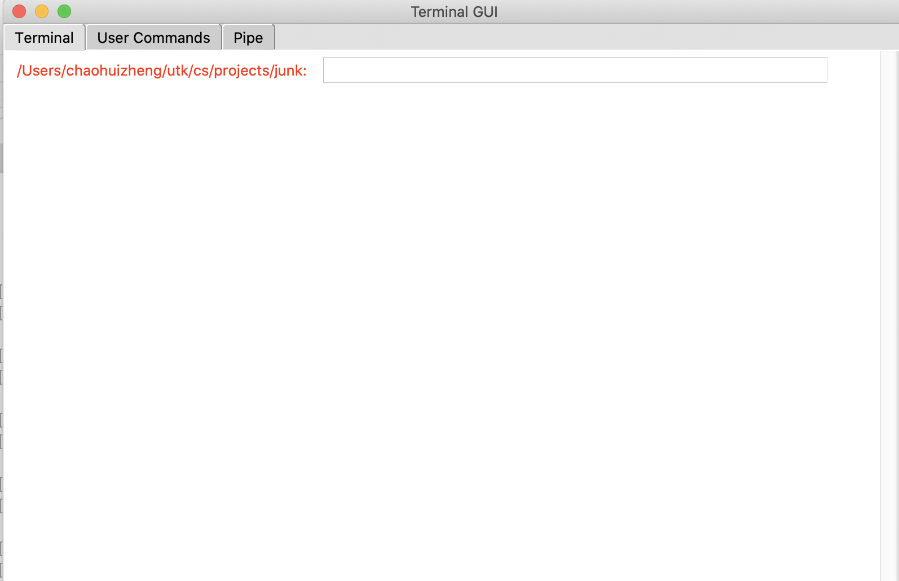
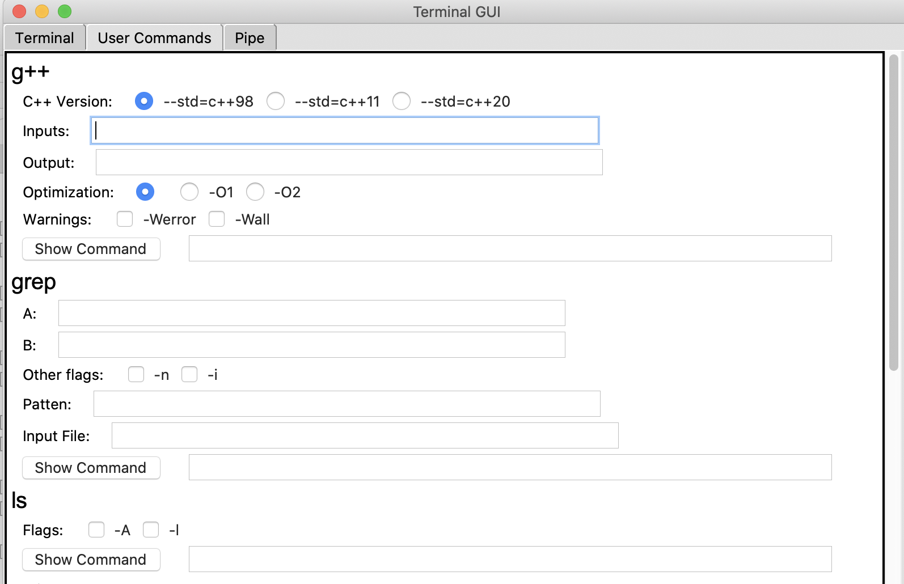
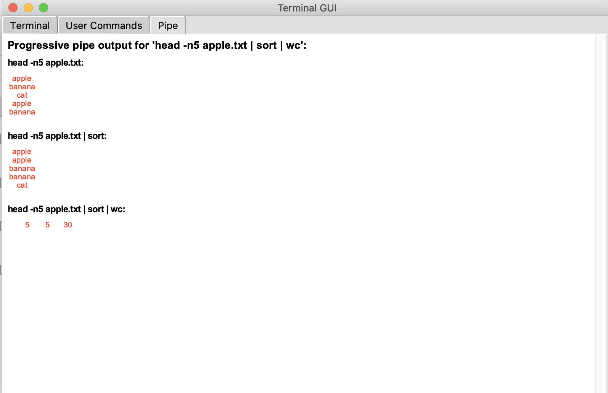

# TerminalGui

Ankush & ChaoHui & Hunter

- [Introduction](#introduction)
- [Customer Value](#customer-value)
- [Proposed Solution & Technology](#proposed-solution---technology)
- [Team](#team)
- [Project Management](#project-management)
- [Development Process](#development-process)

## Introduction

As developers, how often do we find ourselves pressing up to search for a command that we executed a dozen steps ago or trying to recall a command we found on StackOverflow last night? Too many to count. We introduce TerminalGUI an all-in-one visual solution to aid everyday programmers like you and me to lookup commands based on relevant descriptions, design macros that shorten lengthy instructions, and quickly traverse a project's history of commands. TerminalGUI will speed up the productivity of developers across the board by eliminating common command-line inefficiencies.

Our idea is not novel in the context of defining a GUI for a terminal. Examples of this include Git SCM and Sublime Merge which are GUI-based applications targeting Git-specific commands. Our differentiator is to take this a step further and apply it to a project-level scope, allowing users to not only save their favorite git commands but also track related commands such as: project building, testing, deployment, etc. Additionally, our users can develop macros for these commands to further speed up their productivity.

Meet the team: We are all Master's students pursuing a degree in Computer Science. Although our backgrounds may slightly differ, we have quite some experience in desiging and implementing software solutions as we collectively hold multiple projects and research/intern experiences.

## Customer Value

Customer Need

- Primary customer: everyday programmers and unix-based terminal users.
- Desire: a streamlined, interactive terminal experience that has a flexible memory and personal customization.
- Rationale: the terminal's history is limited on its own and generally consists of cycling up previously issued commands to find what they might need to execute again. Each user will have their own unique set of frequently used commands and command archetypes and so tailoring the terminal experience to these needs can improve productivity.
- Market context: this tool will not likely be used in a corporate environment unless it first develops a substantial independent user-base. Most corporations already have a work environment already set up for all workers whereas independent users have flexibility in their choice of terminal environment.

Proposed Solution

- Customer expectation: a streamlined terminal experience.
- Benefits: improved productivity.
- Novelty: the UI and expanded history services are arguably an improvement on ease of use.
- Test status: untested.

Measures of Success

- User surveys and reviews.
- If possible, a user study with case and control volunteers to gauge productivity gains/losses and overall ease-of-use.

## Proposed Solution & Technology

Our software can be broken down into three parts:

- The user interface that allows users interactively to select, search, click, execute, add, and remove commands.
- The filesystem or server to store the commands.
- The ability to execute arbitrary shell commands.

To accomplish this, we decide to choose `Python` as our primary language for several reasons.

- `Python` has well-developed `GUI` libraries, such as `PyQt5`, `Tkinter`, etc.
- `Python` can execute an arbitrary shell command and capture the output.
- All of our team members have experience with `Python`

Our team has decided that `Tkinter` is the best choice to render the user interface. For the user interface display, a drop-down menu, radio button, checkbox, regular button, and text box widgets are mainly used. `Tkinter` is a cross-platform GUI library and supports a variety of widgets. These widgets also offer customizability. For example, we can easily emphasize the text by coloring it.

We can either use the filesystem or database to store the commands. For the simplicity of our project and limited time, we decide to go with the filesystem and use the `JSON` format. This file will store an array of `JSON` commands. One of the examples is shown below.

```json
{
  "command_name": "g++",
  "categories": {
    "C++ Version": {
      "widget_type": "radio_button",
      "options": ["--std=c++98", "--std=c++11", "--std=c++20"],
      "description": ["Use c++98", "Use c++11", "Use c++20"]
    },
    "Output": {
      "widget_type": "text",
      "description": "The name of the executable"
    },
    "Optimization": {
      "widget_type": "radio_button",
      "options": ["-O1", "-O2", "-O3"],
      "description": ["Optimize", "Optimize", "Optimize"]
    },
    "Warnings": {
      "widget_type": "checkbox",
      "options": ["-Werror", "-Wall"],
      "description": ["Make all warnings into errors", "Show all warnings"]
    }
  }
}
```

Finally, Python's `subprocess` module can invoke shell command and capture the stdout and stderr and render it in the user interface.

## Team

- ChaoHui: czheng4@vols.utk.edu
- Hunter: hleef@vols.utk.edu
- Ankush: apatel79@vols.utk.edu

## Project Management

Our final prototype is composed of three components, which are "terminal", "user commands", and "pipe".
We show the picture of each component below along with its explanation.

- Terminal tab
  With the terminal tab, we have all of the interactability as supplied by a standard unix-based terminal. Commands can be typed in and executed, however, our interface allows users to move the cursor within a typed command via clicks which is not possible with a standard terminal interface. This is quite useful for fixing a command quickly as opposed to either re-entering the entire command or using the arrow keys to navigate to the particular error point. Users can also alter a previously executed command, then re-execute, and see the output in the same window position as opposed to the continous output that is seen with standard terminals (note this is akin to code interaction within a Jupyter Notebook).
  

- User commands
  We store pre-defined user commands in `data/commands.json` in JSON format described in the section "Proposed Solution & Technology". Users are able to type in the text box, check the checkbox, and select the radio button to compose the final command. Clicking the "Show Command" button will show the final command.
  

- Pipe
  Below shows an example of commands `head -n5 apple.txt | sort | wc`, which is involved two pipes.
  As developers, we use pipes quite often to accomplish the daily task. Think about how many times we have to decompose/split the entire command to analyze each output. Not only it's tedious but also time-consuming to type each subcommand. Our `pipe` is your friend. It does this automatically by showing you the progressive output to help you debug.
  

## Development Process

- Our team has elected to use the agile development method as it is an iterative and flexible
  approach. Our team is already familiar with this approach and thus we all feel most
  comfortable with it plus we already have an overall picture of how our software should work
  to serve our customer. This contrasts with two other methods we considered: waterfall and
  extreme programming.
- The waterfall method is too strict and linear for our team dynamic not
  to mention that it the planning stage can take up a significant time if not organized properly.
  Our team does not feel a need to spend so much time planning, as I mentioned we have a overall
  picture of how things should work out and thus having the freedom provided by the agile method
  is perferred.
- Extreme programming could fit our project as it is arguably as flexible as agile,
  however with our team size being 3 members strong it seems like it would be a challenge (mainly
  regarding pair programming). Extreme programming can lead to cleaner coding, but as our team
  is small and we know we can work well together it becomes less of concern and so ultimately
  agile remains our choice due to familiarity.

# Future work

1. Add customization settings to allow users to change font size, font type, color theme, etc.
2. Add a search bar in the `User Commands` tab to allow users to search for commands by keyword.
3. Add the ability to perform command syntax checking in `Terminal`, which warns the users if the command couldn't be found.
